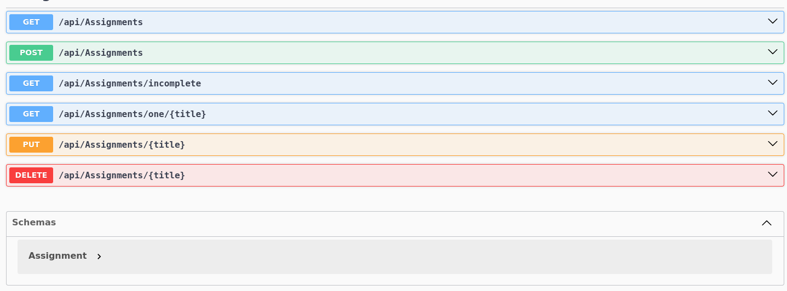
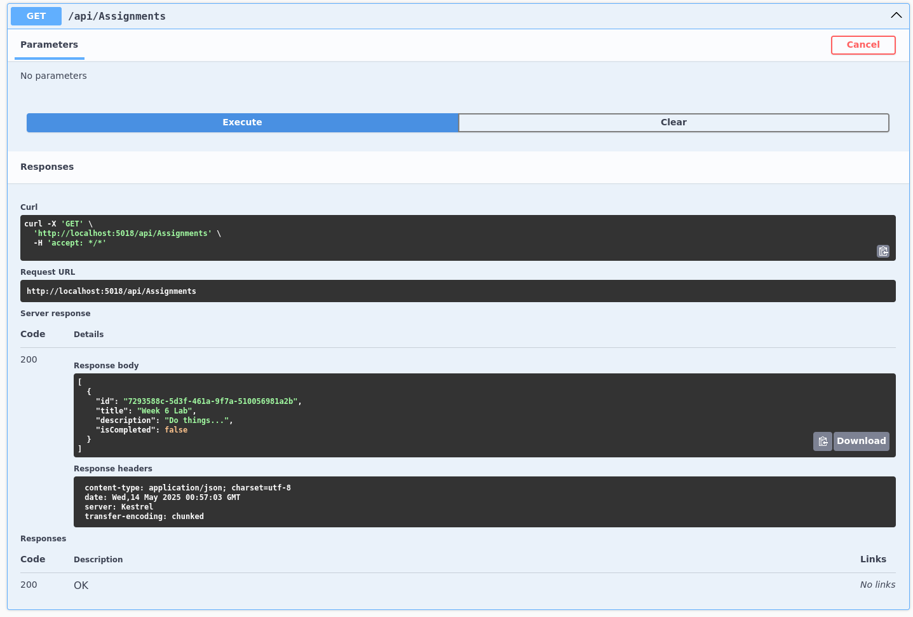
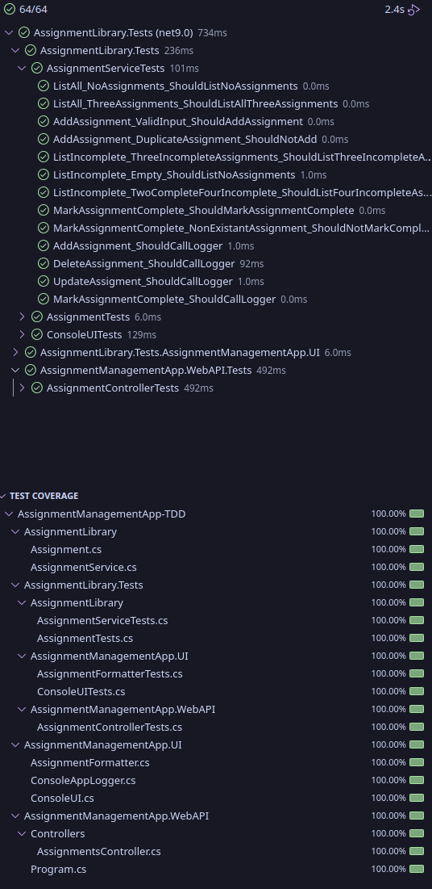

# AssignmentManagementApp-TDD

Week is in branches

[Week 5](#week-5)

[Week 6](#week-6)

## Responses
### Week 5

There were a few differences between working with HTTP and working with the Console. The main one is handling the HTTP requests and making sure that they have a valid response vs Console can just have bool or whatever fits. The second is that testing for which HTTP request came back was a bit difficult vs knowing what the console was gonna return. And that The data persisted between tests.

---

### Week 6

When building tests for the console, if the input was invalid, it would get stuck in an infinite loop without giving a reason as to why. With HTTP, it gave proper errors and details when things break. I didn't encounter any major difficulties, but I did sometimes encounter issues with the interface naming conventions auto correcting to the built in types. IAppLogger (Ours) -> ILogger (Built-in). One of the benifits I observed was that the separating of issues allowed me to more quickly debug and focus on what had broken. Certain tests would pass, while the ones using those being tested would fail, so I knew it was the outer layer.

#### Extra Credit

---